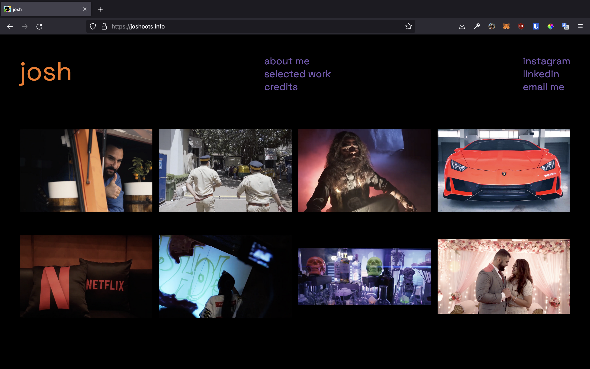
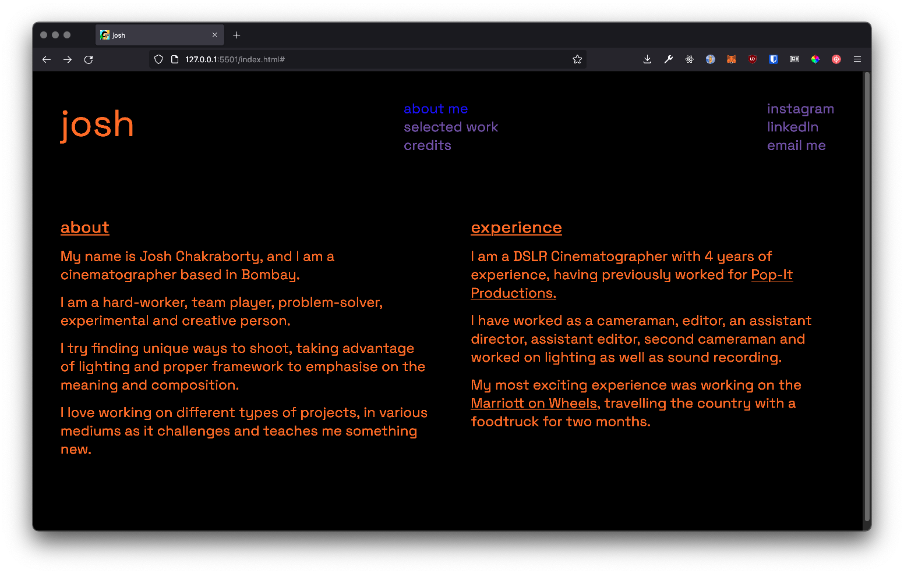

# `📸` JOSHOOTS

---
## [visit website](https://joshoots.info)

> website built to showcase Josh's cinematographic and editorial work in film
---

## `📹 ABOUT`

> josh is a cinematographer based in bombay. to keep costs low, the entire website was built using JSON as a CMS, making it easily editable at any given time

### `⚜️` `DESIGN + DEV`
> designed by in sketch 
> coded in HTML/CSS/JS with JSON as a CMS 
created by [@majiinbju](https://github.com/majiinbju)

### `🪪` `LICENSE`
> Joshoots is [MIT licensed](https://github.com/majiinbju/joga/blob/main/LICENSE)
---
> [bajju.info](https://www.bajju.info) &nbsp;&middot;&nbsp;
> [@majiinbju](https://github.com/majiinbju) &nbsp;&middot;&nbsp;
> [linkedin](https://www.linkedin.com/in/vivek-bajaj-4a8035152/) &nbsp;&middot;&nbsp;
> [email](mailto:hi@vivekbajaj.design)
